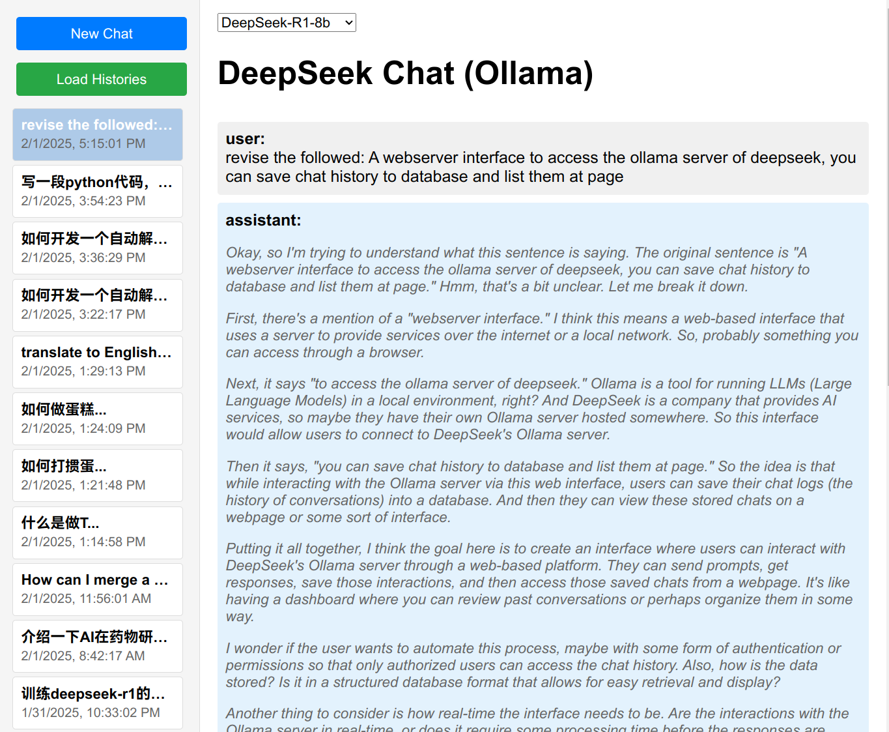

# deepseek-client
A web-based interface designed to access DeepSeek's Ollama server, enabling users to save chat history in a database and display these interactions on a webpage.

Ollama server should be runing at local host.

pip install flask

python app.py

Then in the browser:
127.0.0.0.1:5000

